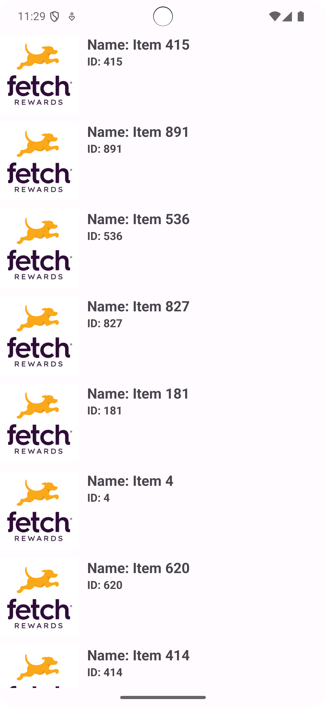

# Design Decisions

## Architecture
 - Single Activity, Multiple Fragments design
 - MVMM Layered architecture for future extension and separation of concerns
 - View Model will be hosted at activity scope for reuse of data in the future
 - IO calls is made using Repository layer
 - Recycler views to display lists for better performance in case of very long lists
 - All background work to be done on IO threads, coroutines and not on the main thread
 - Lazy initialization of services (such as HTTP) to not bloat startup

## Future goals/What I would have done better with more resources (time or people)
- Support dependency injection
- Test driven development
- If not test driven development, at-least a full suite of unit tests
- More accessibility support

### Other trivial decisions
- Commit frequently
- Clean, reusable code

### App Screenshot:

